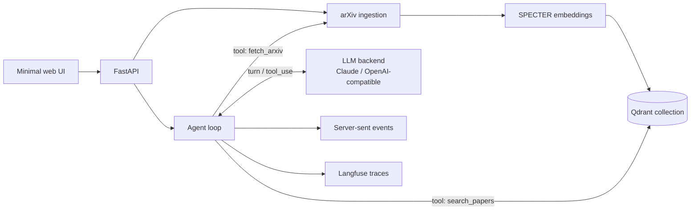

# Research Brief Agent

A production-style research brief service for applied science teams. A user submits a research question, the service retrieves relevant arXiv papers, reads full text for promising candidates when available, and streams back a cited decision memo with methods, baselines, risks, uncertainty, next steps, latency, and estimated cost.

This is intentionally more than a generic RAG demo: the main artifact is a decision memo, the retrieval layer is persistent, the agent emits operational diagnostics, and the eval harness treats latency and cost as first-class product metrics.

The synthesis backend is pluggable: native Claude (Anthropic) or any OpenAI Chat Completions-compatible endpoint (OpenAI, local models, OpenRouter, codex/opencode-style gateways). Token usage and cost are read from the provider response, not estimated from text length.

> Architecture note: this is a true tool-using agent loop. The model is given a catalogue of research tools (semantic search, arXiv backfill, evidence expansion, full-text reading) and decides which to call and in what order until it has enough evidence to write the memo. Turn, discovery, and tool-call budgets (`AGENT_MAX_ITERATIONS`, `AGENT_MAX_SEARCH_CALLS`, `AGENT_MAX_TOOL_CALLS`) bound latency and cost so runs stay predictable, and every turn and tool call is a Langfuse span. The same canonical tool-use layer drives both the Anthropic and OpenAI-compatible backends.

## Architecture



The agent exposes four tools to the model: `search_papers` (semantic retrieval over the Qdrant corpus), `fetch_arxiv` (pull fresh metadata from arXiv and index it when the corpus is thin), `get_paper_details` (abstract-level evidence for specific papers), and `get_full_text` (download a paper PDF and read its body — methods and results, not just the abstract). The model composes these, then writes the cited memo as its final turn. Full-text fetching runs in-process (pypdf), so it stays deployable with no external paper service.

## Public API

- `POST /briefs/stream` streams agent events and the final cited brief.
- `POST /ingest` fetches arXiv papers by query/date window, embeds them with SPECTER, and stores them in Qdrant.
- `GET /papers/search?query=...&k=10` returns semantic search results for debugging and demos.
- `GET /health` reports service, vector backend, paper count, and tracing status.

Brief requests are shaped around real research work:

```json
{
  "research_question": "What methods are promising for retrieval-augmented scientific literature review systems?",
  "domain": "applied machine learning",
  "constraints": ["Prefer measurable citation grounding", "Track latency and cost"],
  "max_papers": 8,
  "brief_type": "decision_memo"
}
```

## Local Quickstart

```bash
cp .env.example .env
docker compose up --build
```

Open `http://localhost:8000` for the minimal UI or use the API directly:

```bash
curl -X POST http://localhost:8000/ingest \
  -H 'content-type: application/json' \
  -d '{"query":"cat:cs.LG","max_papers":25}'

curl -N -X POST http://localhost:8000/briefs/stream \
  -H 'content-type: application/json' \
  -d '{"research_question":"How should uncertainty be handled in scientific ML decision support?","domain":"cs.LG","max_papers":6}'
```

Set credentials for the configured synthesis backend (`ANTHROPIC_API_KEY` for the default `anthropic` provider, or `OPENAI_API_KEY` for the `openai` provider). Without a key, the service returns a deterministic fallback memo, which keeps local tests and CI runnable.

## Configuration

Environment variables are documented in [.env.example](.env.example). Key settings:

- `QDRANT_URL`, `QDRANT_COLLECTION`, `QDRANT_API_KEY`
- `VECTOR_STORE_BACKEND=qdrant` for persistence or `memory` for tests
- `EMBEDDING_MODEL=sentence-transformers/allenai-specter`
- `LLM_PROVIDER=anthropic|openai`, `LLM_MAX_TOKENS`, `LLM_TEMPERATURE`
- `ANTHROPIC_API_KEY`, `ANTHROPIC_MODEL` (Claude backend)
- `OPENAI_API_KEY`, `OPENAI_MODEL`, `OPENAI_BASE_URL` (OpenAI-compatible backend)
- `AGENT_MAX_ITERATIONS`, `AGENT_MAX_SEARCH_CALLS`, `AGENT_MAX_TOOL_CALLS` (agent loop budgets)
- `FULL_TEXT_CHAR_BUDGET`, `FULL_TEXT_MAX_PAPERS`, `FULL_TEXT_TOTAL_PAPER_BUDGET`, `FULL_TEXT_TIMEOUT_S` (full-text tool limits)
- `LANGFUSE_PUBLIC_KEY`, `LANGFUSE_SECRET_KEY`, `LANGFUSE_HOST`

## Evaluation

Run the latency/cost benchmark suite:

```bash
uv run python evals/run_eval.py
```

It writes JSONL to `evals/reports/latest.jsonl` and a README-ready Markdown table to `evals/reports/latest.md`.

Tracked metrics:

- end-to-end latency
- retrieval latency
- LLM call count (one per agent turn) and tool-call count
- measured input/output tokens
- estimated cost per brief
- number of cited papers
- Langfuse trace coverage

Secondary review checks are included in the rendered report: answer relevance, citation grounding, unsupported-claim risk, and uncertainty/refusal behavior.

## Development

```bash
uv sync --dev
uv run pytest -q
uv run ruff check .
uv run ruff format .
uv run uvicorn src.api.main:app --reload
```

Current verification:

```text
36 passed, 1 warning; ruff clean
```

## Project Structure

```text
src/
  api/             FastAPI app and streaming routes
  agent/           Tool-using agent loop, research tools, and toolset adapter
  llm/             Pluggable tool-using backends (Anthropic, OpenAI-compatible)
  ingestion/       arXiv query/date normalization and paper fetching
  retrieval/       Qdrant and in-memory vector stores
  observability/   Langfuse tracing wrapper
  arxiv_client.py  arXiv metadata client
  embeddings.py    SPECTER embedding helper
evals/
  benchmarks/      Curated research questions
  run_eval.py      Latency/cost evaluation runner
static/
  index.html       Minimal streaming demo UI
```
