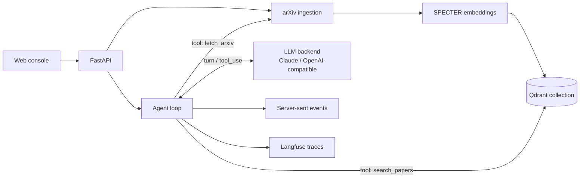

# Research Brief Agent

A source-grounded briefing service for AI/ML and scientific-ML engineers and researchers making evidence-backed engineering decisions: method selection, architecture tradeoffs, technique adoption, and deployment/uncertainty risk. A user submits a research decision question; the service retrieves relevant papers, reads the full text of promising arXiv candidates when available, and streams back a cited memo covering recommendation, evidence, tradeoffs, risks, uncertainty, next steps, latency, and measured cost. The output is the memo, not a chat answer or a ranked list of links.

The evidence backend is scholarly literature: persistent Qdrant retrieval with SPECTER embeddings, plus on-demand arXiv backfill when the corpus is thin. Full-text PDFs are read in-process, and the agent blocks the final memo until that evidence has been read, or records a degraded run if it cannot. Each run reports latency, token usage, and cost taken from the provider response, every turn and tool call is traced to Langfuse, and the streaming API writes JSONL run records plus structured request/run logs.

Synthesis runs against Anthropic (native Claude) or any OpenAI Chat Completions-compatible endpoint (OpenAI, local models, OpenRouter, codex/opencode-style gateways). The agent loop hands the model a catalogue of evidence tools (semantic search, arXiv backfill, abstract-level detail, full-text reading) and lets it choose which to call and in what order; turn, discovery, and tool-call budgets (`AGENT_MAX_ITERATIONS`, `AGENT_MAX_SEARCH_CALLS`, `AGENT_MAX_TOOL_CALLS`) bound latency and cost. The same tool-use layer drives both backends.

## Architecture



The agent exposes four tools to the model: `search_papers` (semantic retrieval over the Qdrant corpus), `fetch_arxiv` (pull fresh metadata from arXiv and index it when the corpus is thin), `get_paper_details` (abstract-level evidence for specific papers), and `get_full_text` (download a paper PDF and read its body: methods and results, not just the abstract). The model composes these, then writes the cited decision brief as its final turn. Full-text fetching runs in-process (pypdf), so it stays deployable with no external paper service.

To keep multi-turn runs from repeatedly paying for the same large evidence payloads, the agent compacts older tool results before each provider call. The newest tool result is kept raw for one turn, then older search/detail/full-text payloads are replaced with IDs, titles, errors, and bounded excerpts while preserving the provider-required tool-call/tool-result transcript shape.

## Public API

- `POST /briefs/stream` streams agent events and the final cited brief.
- `POST /ingest` fetches arXiv papers by query/date window, embeds them with SPECTER, and stores them in Qdrant. The query accepts plain words (wrapped as an `all:` search) or arXiv field syntax such as `cat:cs.LG AND all:rag`.
- `GET /papers/search?query=...&k=10` returns semantic search results. Used for debugging and direct API access; the web console no longer surfaces it.
- `GET /health` reports service, vector backend, paper count, and tracing status.

A brief request looks like:

```json
{
  "research_question": "Should an AI team use agentic RAG for technical decision briefs, and what tradeoffs matter?",
  "domain": "applied machine learning / AI product",
  "constraints": ["Prefer measurable citation grounding", "Track latency, cost, and operational risk"],
  "max_papers": 8,
  "brief_type": "decision_memo"
}
```

`POST /briefs/stream` uses one JSON object per SSE `data:` frame. Every object
contains an `event` string, validated by `src/api/sse.py`. Stable event types:

| Event | Required fields | Meaning |
|---|---|---|
| `started` | `message` | Run accepted and agent work started. |
| `retrieval_complete` | `returned`, `latency_ms` | Offline fallback retrieval finished. |
| `llm_turn` | `turn`, `tools_requested` | One provider turn completed. |
| `tool_call` | `name`, `arguments` | Agent is dispatching a requested tool. |
| `tool_result` | `name` | Tool finished; extra metadata depends on the tool. |
| `discovery_budget_reached` | `reason`, `message` | Search/fetch tools were withdrawn so the model must read or write. |
| `evidence_required` | `reason`, `required_full_text_papers`, `full_text_fetched`, `candidate_ids`, `message` | Final text was blocked until full text is read. |
| `warning` | `code`, `message` | Recoverable issue such as thin evidence or budget-forced synthesis. |
| `degraded` | `reason`, `message` | The run continues in a degraded mode, usually fallback synthesis. |
| `error` | `stage`, `message`, `type` | Live boundary failure before deterministic fallback. |
| `synthesis_complete` | `llm_calls` | Memo synthesis path finished. |
| `final` | `data` | Final `BriefResponse` payload. |

## Local Quickstart

Lightest path, no Docker:

```bash
cp .env.example .env
uv sync --dev
uv run uvicorn src.api.main:app --reload
```

Open `http://localhost:8000`. The console is ask-first: type a technical decision
question and run the agent, which retrieves and reads evidence itself. If Qdrant is not
already running at `QDRANT_URL`, local mode falls back to the in-memory store and
`/health` reports `ready=false` with `vector_store.fallback=true`. The first
search/brief call may download the SPECTER embedding model unless it is already
cached.

Persistent local retrieval requires a Qdrant server listening on `QDRANT_URL`
before uvicorn starts. If Qdrant starts after uvicorn, restart uvicorn so the app
selects the Qdrant backend during startup.

Docker Compose remains available for the full API + Qdrant stack:

```bash
cp .env.example .env
docker compose up --build
```

For a repeatable production-mode release smoke, use the isolated smoke stack. It
enables required API-key auth and run-record persistence, pins Qdrant 1.18.0, and
uses a deterministic OpenAI-compatible provider that drives the real
`search_papers` → `get_full_text` → synthesis loop:

```bash
docker compose -f docker-compose.smoke.yml up --build -d
curl http://127.0.0.1:8767/health
curl -X POST http://127.0.0.1:8767/ingest \
  -H 'content-type: application/json' \
  -H 'X-API-Key: smoke-api-key' \
  -d '{"query":"all:retrieval augmented generation","max_papers":2}'
curl -N -X POST http://127.0.0.1:8767/briefs/stream \
  -H 'content-type: application/json' \
  -H 'X-API-Key: smoke-api-key' \
  -d '{"research_question":"Should an AI team use retrieval-augmented generation for technical decision support?","max_papers":2}'
```

The smoke still uses live arXiv metadata/PDF access for ingest and full-text reading;
only the LLM provider is deterministic. Its named volumes are isolated from the
default Compose stack. Do not mount an existing Qdrant 1.9.x volume directly into
1.18.0: the storage formats are not directly compatible across that jump, so migrate
through a supported snapshot/export path first.

The Linux image resolves PyTorch from the explicit CPU wheel index and bakes the
SPECTER2 base model and both adapters. The verified local artifact is 2.06 GB, down
from 11.27 GB before removing CUDA runtime packages.

Use the API directly:

```bash
curl -X POST http://localhost:8000/ingest \
  -H 'content-type: application/json' \
  -d '{"query":"cat:cs.LG","max_papers":25}'

curl -N -X POST http://localhost:8000/briefs/stream \
  -H 'content-type: application/json' \
  -d '{"research_question":"How should teams communicate uncertainty when neural models support technical decisions?","domain":"cs.LG","max_papers":6}'
```

Set credentials for the configured synthesis backend (`ANTHROPIC_API_KEY` for the default `anthropic` provider, or `OPENAI_API_KEY` for the `openai` provider). Without a key, the service returns a deterministic fallback memo, which keeps local tests and CI runnable.

## Configuration

Environment variables are documented in [.env.example](.env.example). Key settings:

- `ENVIRONMENT=local|production`
- `API_KEYS`, `API_KEY_HEADER_NAME`, `RATE_LIMIT_REQUESTS`, `RATE_LIMIT_WINDOW_SECONDS`
- `QDRANT_URL`, `QDRANT_COLLECTION`, `QDRANT_API_KEY`
- `VECTOR_STORE_BACKEND=qdrant` for persistence or `memory` for tests
- `EMBEDDING_MODEL=allenai/specter2_base`
- `EMBEDDING_DOCUMENT_ADAPTER=allenai/specter2`
- `EMBEDDING_QUERY_ADAPTER=allenai/specter2_adhoc_query`
- `LLM_PROVIDER=anthropic|openai`, `LLM_MAX_TOKENS`, `LLM_TEMPERATURE`
- `ANTHROPIC_API_KEY`, `ANTHROPIC_MODEL` (Claude backend)
- `OPENAI_API_KEY`, `OPENAI_MODEL`, `OPENAI_BASE_URL` (OpenAI-compatible backend)
- `AGENT_MAX_ITERATIONS`, `AGENT_MAX_SEARCH_CALLS`, `AGENT_MAX_TOOL_CALLS` (agent loop budgets)
- `TRANSCRIPT_KEEP_RECENT_TOOL_RESULTS`, `TRANSCRIPT_FULL_TEXT_EXCERPT_CHARS`, `TRANSCRIPT_ABSTRACT_EXCERPT_CHARS` (prompt-token compaction)
- `FULL_TEXT_CHAR_BUDGET`, `FULL_TEXT_MAX_PAPERS`, `FULL_TEXT_TOTAL_PAPER_BUDGET`, `FULL_TEXT_TIMEOUT_S` (full-text tool limits)
- `PDF_EXTRACTOR=auto|pypdf|docling` (`auto` uses Docling when installed, then falls back to pypdf)
- `LANGFUSE_PUBLIC_KEY`, `LANGFUSE_SECRET_KEY`, `LANGFUSE_HOST`
- `LOG_LEVEL`, `STRUCTURED_LOGS`, `RUN_RECORDS_DIR`, `RUN_RECORDS_REQUIRED`
- `DEFAULT_MAX_PAPERS`, `MAX_INGEST_RESULTS`, `MAX_RETRIEVAL_RESULTS`, `RETRIEVAL_MIN_SCORE`
- `QUERY_EXPANSION_ENABLED`, `SEARCH_AUTO_BACKFILL=false`, `SEARCH_BACKFILL_QUERY_EXPANSION`, `RERANK_ENABLED=false`, `RERANK_MODEL`, `RERANK_CANDIDATE_K`

## Fly Deployment

`fly.toml` runs the real agent loop behind `X-API-Key`, starts Qdrant on the same Fly machine, and mounts `/qdrant/storage` for persistence. The Docker image bakes the SPECTER2 base model and adapters during build so the first request avoids the model download.

```bash
fly auth login
fly apps create research-brief-agent
fly volumes create qdrant_data --region lhr --size 3 --app research-brief-agent

export DEMO_API_KEY="$(openssl rand -hex 32)"
fly secrets set --app research-brief-agent \
  ENVIRONMENT=production \
  API_KEYS="$DEMO_API_KEY" \
  LLM_PROVIDER=anthropic \
  ANTHROPIC_API_KEY="$ANTHROPIC_API_KEY"

fly deploy --app research-brief-agent
curl https://research-brief-agent.fly.dev/health
curl -N -X POST https://research-brief-agent.fly.dev/briefs/stream \
  -H "content-type: application/json" \
  -H "X-API-Key: $DEMO_API_KEY" \
  -d '{"research_question":"What methods help source-grounded technical decision briefs?","max_papers":3}'
```

For an OpenAI-compatible backend, set `LLM_PROVIDER=openai`, `OPENAI_API_KEY`, and optionally `OPENAI_BASE_URL` with `fly secrets set`.

## Evaluation

Run the latency/cost benchmark suite:

```bash
uv run python evals/run_eval.py
```

It writes JSONL to `evals/reports/latest.jsonl` and a README-ready Markdown table to `evals/reports/latest.md`.

For a repeatable live-model cost check without Qdrant, arXiv, or PDF downloads, use the fixture corpus while keeping the configured LLM provider:

```bash
LLM_PROVIDER=openai OPENAI_BASE_URL=https://api.deepseek.com OPENAI_MODEL=deepseek-v4-flash \
  uv run python evals/run_eval.py --fixture-corpus
```

CI also runs the hermetic core benchmark as a deterministic quality gate:

```bash
uv run python evals/run_eval.py --offline-fixture --core --quality-gate \
  --jsonl /tmp/research-brief-core-eval.jsonl \
  --markdown /tmp/research-brief-core-eval.md
```

The fixture corpus contains one synthetic relevant paper per benchmark case.
The gate fails on missing fixture coverage, zero-hit retrieval, warnings,
hallucinated citations, or inappropriate uncertainty signaling. It validates
offline retrieval and response contracts; full-text usage remains a live-agent
metric because the no-key fallback does not run the tool loop.

When `OPENAI_BASE_URL=https://api.deepseek.com` and `OPENAI_MODEL=deepseek-v4*`,
the OpenAI-compatible adapter disables DeepSeek thinking mode so the agent receives
normal assistant `content` and tool calls instead of spending the output budget on
reasoning-only fields.

Tracked metrics:

- status (`ok`, warning count, or deterministic fallback)
- end-to-end latency
- retrieval latency
- LLM call count (one per agent turn), tool-call count, and full-text success/attempts
- measured input/output tokens
- estimated cost per brief
- number of cited papers
- Langfuse trace coverage

Secondary review checks are included in the rendered report: answer relevance, citation grounding, unsupported-claim risk, and uncertainty/refusal behavior.

## Development

```bash
uv sync --dev
uv run pytest -q
uv run ruff check .
uv run ruff format .
uv run uvicorn src.api.main:app --reload
```

Current verification:

```text
112 passed, 1 warning; ruff clean; 7-case offline core quality gate passing
```

## Project Structure

```text
src/
  api/             FastAPI app and streaming routes
  agent/           Tool-using agent loop, evidence tools, and toolset adapter
  llm/             Pluggable tool-using backends (Anthropic, OpenAI-compatible)
  ingestion/       arXiv query/date normalization and paper fetching
  retrieval/       Qdrant and in-memory vector stores
  observability/   Langfuse tracing wrapper
  arxiv_client.py  arXiv metadata client
  embeddings.py    SPECTER embedding helper
evals/
  benchmarks/      Curated AI/ML & scientific-ML decision questions
  run_eval.py      Latency/cost evaluation runner
static/
  index.html       Single-page web console: ask a question, watch the streaming
                   timeline, read the cited memo, inspect evidence and diagnostics
```
